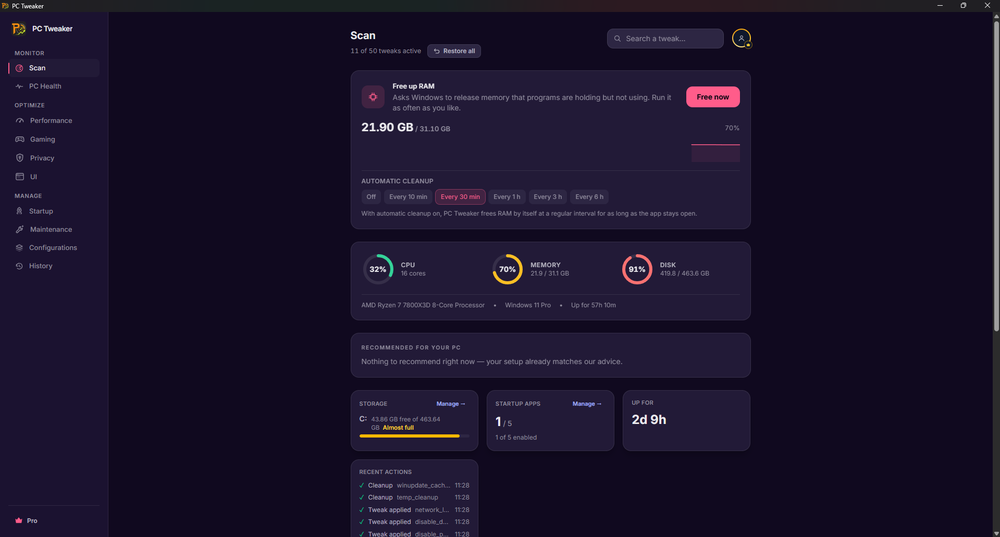

<p align="center">
  
</p>

<h1 align="center">PC Tweaker</h1>

<p align="center"><strong>Tune Windows with the changes in plain sight.</strong><br>Gaming, privacy and maintenance controls, with restore tools for supported settings.</p>

<p align="center">
  <a href="https://github.com/AurelioAvila/pc-tweaker-app/actions/workflows/checks.yml"></a>
  <a href="https://github.com/AurelioAvila/pc-tweaker-app/actions/workflows/build.yml"></a>
  <a href="https://github.com/AurelioAvila/pc-tweaker-app/releases"></a>
  <a href="https://github.com/AurelioAvila/pc-tweaker-app/releases"></a>
  
  <a href="LICENSE"></a>
</p>

**[Download Free for Windows](https://github.com/AurelioAvila/pc-tweaker-app/releases/latest)** · **[Microsoft Store](https://apps.microsoft.com/detail/9nh3c6dt1g87)** · [Website](https://pctweaker.app/) · [Support](https://pctweaker.app/support/) · [Release notes](CHANGELOG.md)

## Install

Download an installer from an official channel above, or use Windows Package Manager:

```powershell
winget install --id AurelioAvila.PCTweaker --exact
```

To check for a package update:

```powershell
winget upgrade --id AurelioAvila.PCTweaker --exact
```

Package catalogs can lag behind a release. Check the release version before installing. Windows 10/11 x64 is the current binary target; individual features depend on the Windows build, edition, drivers and available hardware. App compatibility does not extend Microsoft's support lifecycle for your operating system.

## What you can do

| Area | Controls and tools |
| --- | --- |
| Gaming | Game Sessions, supported gaming settings, hardware scheduling options and X3D placement controls |
| Performance | Power configuration, startup controls and foreground scheduling settings |
| Hardware | Available sensor readings, supported thermal profiles and driver updates through Windows Update |
| Privacy | Supported Windows advertising, tracking and diagnostic settings; optional password breach lookup |
| Maintenance | Integrity checks, guided repair, storage analysis and cleanup with operation-specific recovery limits |
| Interface | File extensions, taskbar options, appearance and supported Windows preferences |

Read the effect and trade-offs before applying a setting. A disabled tweak is not evidence of a fault, and a higher configuration score is not a measured performance gain.

### Five new native power controls in 1.9.0

The catalog now contains **61 tweaks: 37 Free and 24 Pro**. These five additions change only mains-power policy in the selected Windows plan. They record the original plan and value before writing, verify the result, and leave battery policy unchanged.

| Control | Access | Purpose and limits |
| --- | --- | --- |
| CPU energy-performance preference | Free | Favors performance on systems with autonomous CPPC support; power use and heat can increase. |
| USB selective-suspend diagnosis | Free | Investigates wake or disconnect problems. Windows recommends leaving selective suspend enabled normally; restore after testing. |
| PCIe link power management | Pro | Disables ASPM for troubleshooting devices affected by link transitions; idle power use can increase. |
| Short-thread scheduling preference | Pro | Prefers performant cores on CPUs with multiple efficiency classes; does not impose fixed affinity. |
| Long-thread scheduling preference | Pro | Prefers performant cores for longer work on compatible hybrid CPUs; other cores remain available. |

These controls use Windows power APIs. Unsupported hybrid settings are refused before a system write. No FPS, DPC-latency or micro-stutter improvement is claimed without a workload-specific measurement.

<p align="center"></p>

## What changes on your system

PC Tweaker can change registry values, power settings, services, startup entries and selected network settings. Other tools interact with files, Windows repair utilities, drivers or supported hardware controls. Administrator access is requested for operations that require it.

| Operation | Recovery scope |
| --- | --- |
| Supported setting tweaks | Previous values are stored for individual restore and Restore All. Check each operation's result. |
| Cleanup sent to the Recycle Bin | Recoverable while the files remain in the bin. This does not free their occupied space until emptied. |
| Third-party cache cleanup | Deletes selected caches permanently. Applications may need to rebuild them; shader rebuilding can cause temporary stutter. |
| Selective cookie cleanup | Copies the database before changing it; restore follows the cleaner's instructions. |
| DISM/SFC, driver updates and hardware controls | Separate recovery procedures and limits; these are not covered by a universal registry rollback guarantee. |

**Restore All is not a Windows system image or a recovery guarantee.** Keep normal backups for data you cannot replace. Settings that reduce security, including disabling Memory Integrity/VBS, have material trade-offs; inspect the disclosure before considering them.

## Performance evidence

There is no universal FPS, micro-stutter or DPC-latency improvement. Results depend on the workload and starting configuration. A settings count or health score is not a benchmark.

The following compact benchmark register distinguishes measured results from missing evidence:

| Test | Metric | Verified comparative result |
| --- | --- | --- |
| Repeatable game replay | Mean FPS, 1% low, p99 frame time, stutter-event count | Not yet established by a reproducible result package linked here |
| CPU benchmark | Repeated single- and multi-thread scores | Not established |
| DirectX graphics benchmark | Graphics score, frame-time distribution | Not established |
| Driver latency trace | DPC/ISR durations and module attribution | Not established |
| App overhead | CPU time, working set, wakeups, baseline versus monitoring | Not established |

The website has previously displayed a 330-to-551 FPS comparison. Its drawn frame-time traces are illustrative; they are not raw capture data. Treat any individual demonstration as specific to its setup until the full test conditions and repeat runs are available.

For useful comparisons, keep the game build, scene, settings, drivers, power source and capture method fixed. Warm caches, alternate baseline/tuned runs, retain all valid runs and publish raw data. Separate security-reducing configurations from normal recommendations. Report regressions and unchanged results alongside gains.

## Free and Pro

Free does not require an account. It includes core tweaks, scans, supported restore tools, hardware monitoring and selected maintenance tools. Pro adds advanced tools, guided repair, additional cleanup options and Game Sessions.

| Current plan | Price |
| --- | --- |
| Monthly | €9.99 per month |
| Annual | €59 per year |
| Lifetime | €74.99 once, while offered |

Annual billing is approximately 51% below twelve monthly payments. Check the app and checkout for current offers, taxes and renewal terms. Existing lifetime purchases retain the access promised when purchased. Payments use Stripe Checkout; the app does not handle card details. Pro is linked to the purchasing account; the app refreshes its license when you return from checkout while online.

## Download integrity and code signing

**PC Tweaker 1.9.0 is code-signed.** Its Windows application and release installers identify **Aurelio Avila** as publisher, using Certum and a trusted timestamp.

Windows Authenticode and Tauri update signatures have different roles. Authenticode identifies the Windows publisher and detects changes after signing. Tauri's update signature verifies update packages.

Older releases, including v1.8.0, may be unsigned. Their `.sig` update files do not establish Windows Authenticode signing. Check the exact version and the file's Digital Signatures tab.

To inspect a downloaded installer in PowerShell:

```powershell
Get-AuthenticodeSignature -LiteralPath .\PCTweaker-Setup.exe |
    Select-Object Status, StatusMessage, SignerCertificate, TimeStamperCertificate
Get-FileHash -LiteralPath .\PCTweaker-Setup.exe -Algorithm SHA256
```

A valid signature does not guarantee the absence of SmartScreen prompts. Microsoft evaluates file and publisher reputation separately. See [Microsoft's SmartScreen guidance](https://learn.microsoft.com/en-us/windows/apps/package-and-deploy/smartscreen-reputation). Use an official distribution channel and verify the publisher when prompted.

## Reviews and distribution

Existing feedback remains available at its original source:

- [Softpedia](https://www.softpedia.com/get/Tweak/System-Tweak/Avila-PC-Tweaker.shtml): editorial review 4.5/5; user rating 5.0/5 from 64 votes, checked September 5, 2026.
- [MajorGeeks](https://www.majorgeeks.com/files/details/pc_tweaker.html): listing and reader reviews.
- [SourceForge](https://sourceforge.net/projects/pc-tweaker/#reviews): fulxor wrote, “Helpful and well done, good job!” on August 6, 2026.

The GitHub download badge counts release-asset requests, including assets used for updates. It does not count unique people, unique installations or every distribution channel. Third-party listings may describe older releases; this repository's [LICENSE](LICENSE) is the authoritative source for licensing terms.

## Build from source

Prerequisites: Node.js 22 as used by CI, npm, stable Rust installed with [rustup](https://rustup.rs/), Windows Visual Studio Build Tools with **Desktop development with C++**, a Windows SDK, and Microsoft Edge WebView2. See [Tauri's platform prerequisites](https://v2.tauri.app/start/prerequisites/).

```powershell
git clone https://github.com/AurelioAvila/pc-tweaker-app.git
cd pc-tweaker-app
npm ci
npm run tauri dev
```

Run the frontend and translation checks:

```powershell
npm run build
npm run lint
npm run format:check
npm run check:i18n
npm run check:i18n-quality
npm run check:native-policy
```

**Run the complete Rust suite and full check in a disposable Windows VM with a snapshot.** The Free/Pro policy tests now avoid the Windows tweak adapters. Other existing tests still exercise real file operations and protected-path guards; these are not a replacement for an isolated integration environment. A temporary journal directory alone does not isolate Windows. The focused license, IPC, rollback-store and game-session tests use signed fixtures, a mock runtime, temporary stores or fake operations.

Inside the disposable VM:

```powershell
npm run check
```

Build installers:

```powershell
npm run tauri build
```

Artifacts are written under `src-tauri/target/release/bundle/`. A development build does not acquire an official publisher identity or update-signing key. Release signing is configured separately; follow [RELEASING.md](RELEASING.md), treating Authenticode and update signing as separate verification steps. Never distribute a verification build as an official signed release.

The account and payment backend is in [`backend/`](backend/):

```powershell
cd backend
npm ci
npm test
```

Backend integration tests need a separate configured test environment. Production smoke scripts can create external state and are not part of an ordinary local source check.

The website is in [`site/`](site/): run `npm ci` and `npm run build` from that directory to produce its prerendered pages.

## Report a problem

Use [support](https://pctweaker.app/support/) for billing or private diagnostics. For a reproducible software bug, open a [GitHub issue](https://github.com/AurelioAvila/pc-tweaker-app/issues) with the app version, Windows build, hardware, selected tweak, steps, expected behavior and actual outcome. Remove tokens, email addresses, license files and private paths from public attachments.

## Source availability and license

Tauri 2 and Rust · React and TypeScript · Express, PostgreSQL and Stripe.

PC Tweaker is source-available under a **proprietary license**. Public source access does not make it an OSI-approved open-source project or grant unrestricted redistribution rights. See [LICENSE](LICENSE), [PRIVACY.md](PRIVACY.md) and [TERMS.md](TERMS.md).

Created and maintained by **Aurelio Avila**.
